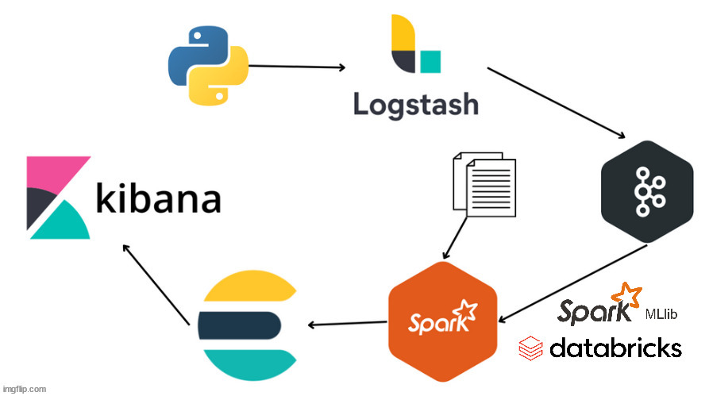

# TAPtube-Popularity-Prediction

## Introduzione

Il progetto **TAPtube Popularity Prediction** si propone di sviluppare un sistema di predizione in tempo reale per stimare la popolarità di un canale YouTube. L'obiettivo è visualizzare graficamente i risultati delle previsioni ottenute, fornendo agli utenti uno strumento per valutare l'andamento potenziale di un canale sulla piattaforma.

## Data Pipeline 
<p align="center"></p>
Le tecnologie utilizzate sono le seguenti:

- **Producer**: riceve i dati (script in python) usufruendo dell'API pubblica di Youtube [Youtube API v3] (https://github.com/youtube/api-samples) e li manda a **Logstash**.

- **[Logstash](https://www.elastic.co/logstash)**: riceve i dati dal ***Producer*** e li scrive sul topic ***taptube_channel***. Agisce da Producer nel modello Producer-Consumer di Kafka.
- **[Kafka](https://kafka.apache.org/)**: riceve i dati da Logstash e li archivia in modo affidabile all'interno di una coda di messaggi. Agisce come broker nel modello Producer-Consumer di Kafka.
- **[Spark](https://spark.apache.org/)**: riceve i dati da Kafka e li arricchisce eseguendo predizioni di machine learning. Agisce da Consumer nel modello Producer-Consumer di Kafka.
- **[Elasticsearch](https://www.elastic.co/)**: Indicizza i dati in modo che possano essere visualizzati e analizzati tramite Kibana.
- **[Kibana](https://www.elastic.co/kibana)**: UI dedicata alla Data Visualization.

Vedi la cartella ***doc*** per maggiori dettagli


## Requisiti
- Docker (Desktop on Windows)
- Docker Compose
- API Key di YouTube (Attenzione tale Key è privata e dipende da utente ad utente, dovrà essere generata utilizzando il proprio account Google).
[Per maggiori dettagli qua è presente la relativa documentazione](https://developers.google.com/youtube/v3/getting-started?hl=it)


## Struttura della Repositery
- El_Kibana/: contiene i file relativi a Elasticsearch e Kibana.
- logstash/: cartella contenente i file relativi a Logstash e la sua configurazione.
- producer/: cartella contenente i file del producer (file.py, Key di Youtube, requisiti vari etc..)
- spark/: contiene due sottocartelle
  - streaming/: relativa allo streaming dei dati;
  - training/: relativa all'allenamento del modello per poi fare streaming.
- .env: File di configurazione (contiene variabili d'ambiente o configurazioni varie).
- .gitignore: file utilizzato per specificare i file e le cartelle che Git deve ignorare.
- docker-compose.yaml: file di configurazione per Docker Compose, utilizzato per gestire i container Docker.


## Utilizzo

1. Clonare la repository del progetto
   
```
git clone 
```

2. Vai nella cartella **producer**, modifica il file ***producer.env*** (MY_API_KEY = "La tua chiave ")

3. Nella root della repository avvia tutti i containers con il file di configurazione ***docker-compose.yaml***

```
cd TAPtube-Popularity-Prediction 
docker-compose up (-d) # -d: per la detach mode
```

## Possibili Ottimizzazioni

1. Si potrebbe far partire il container Producer dopo che il container Logstash sia pronto per accettare flussi di dati, tale ottimizzazione si potrebbe fare in tale modo:

```
# docker-compose--> producer
depends_on:
  logstash:
      condition: service_healthy

# docker-compose--> logstash

healthcheck:
      test: ["CMD", "curl", "-f", "http://localhost:9600/_node/pipelines/main?pretty"] #  fa parte delle API di monitoring di Logstash
      interval: 10s
      timeout: 10s
      retries: 5
```
2. Si potrebbe dare più risorse a Logstash
   
```
deploy:
  resources:
      limits:
          cpus: '0.5' ->  '1'  # Assegna fino a 1 CPU
          memory: 512m  -> 1024m  # Assegna fino a 1 GB di RAM

```

## `Possibili Errori`

1. Se le risorse allocate non sono sufficienti per eseguire tutti i container, è possibile che alcuni container si fermino in modo casuale o non riescano ad avviarsi correttamente.

    Per evitare questo problema, puoi aumentare le risorse allocate a ciascun container.

3. ***Bind for 0.0.0.0:porta_da_te_definita failed: port is already allocated docker***.
 
   Riavvia il docker-desktop


## Link Utili

| Container | URL    | INFO    |
| :-----: | :---: | :---: |
| Kafka-UI | http://localhost:10000   | Apre kafka UI   |
| Kibana | http://localhost:5601   | Apre Kibana   |

## Dataset e Modello pre-allenato

Il **dataset** per allenare il modello e il **modello pre-allenato** caricato dallo script streaming.py per lo streaming di dati in real-time, si trovano nella rispettiva sottocartella.

```
spark/
  ├── streaming/   # relativa allo streaming dei dati
  └── training/ # relativa all'allenamento del modello per poi fare streaming
          └── data  # contiene il dataset
          └── model # modello pre-allenato
```

## Autore

| NOME | COGNOME    | MARICOLA    |
| :-----: | :---: | :---: |
| Giovanni |Salerno | 1000052299   |


